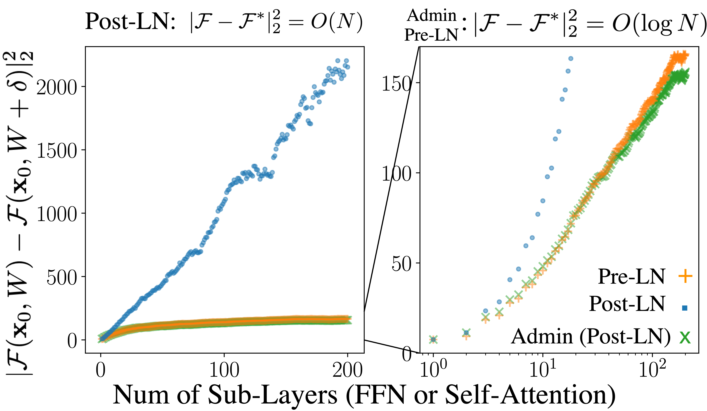

[](https://paperswithcode.com/sota/machine-translation-on-wmt2014-english-french?p=very-deep-transformers-for-neural-machine)

 
 
[](https://microsoft.github.io/admin-torch/) 
 

<h2 align="center">Admin-Torch</h2>
<h5 align="center">Transformers Training **Stabilized**</h5>

<p align="center">
  <a href="#whats-new">What's New?</a> •
  <a href="#key-idea">Key Idea</a> •
  <a href="#how-to-use">How To Use</a> •
  <a href="https://microsoft.github.io/admin-torch/">Docs</a> •
  <a href="https://github.com/microsoft/admin-torch/tree/main/example">Examples</a> •
  <a href="#citation">Citation</a> •
  <a href="https://github.com/microsoft/admin-torch/tree/main/LICENSE">License</a>
</p>

Here, we provide a plug-in-and-play implementation of [Admin](https://arxiv.org/abs/2004.08249),
which stabilizes previously-diverged Transformer training and achieves better performance, 
**without introducing additional hyper-parameters**. The design of Admin is half-precision 
friendly and can be **reparameterized into the original Transformer**. 

______________________________________________________________________
## What's New?

Beyond the [original admin implementation](https://github.com/LiyuanLucasLiu/Transformer-Clinic):
1.  `admin-torch` removed the profilling stage and is **plug-in-and-play**. 
2.  `admin-torch`'s implementation is **more robust** (see below).

Comparison w. the [DeepNet Init](https://arxiv.org/abs/2203.00555) and the [Original Admin Init](https://github.com/LiyuanLucasLiu/Transformer-Clinic) 
(on WMT'17).

|               | Regular batch size (8x4096) |  Huge batch size (128x4096) |
|---------------|--------------------|------------------|
| [Original Admin](https://github.com/LiyuanLucasLiu/Transformer-Clinic)| ✅ | ❌ |
| [DeepNet](https://arxiv.org/abs/2203.00555) | ❌ | ✅ |
| `admin-torch` | ✅ | ✅ |

More details can be found in [our example](https://github.com/microsoft/admin-torch/tree/main/example).

## Key Idea
<h5 align="center"><i>What complicates Transformer training?</i></h5>

For Transformer f, input x, randomly initialized weight w, we describe its stability (``output_change_scale``) as 

<p align="center">
<!-- $E[|f(x, w) - f(x, w + \delta)|_2^2]$ --> 
</p>

In [our study](https://arxiv.org/abs/2004.08249), we show that, an original N-layer Transformer's 
``output_change_scale`` is ``O(n)``, which unstabilizes its training. Admin stabilize Transformer's
training by regulating this scale to ``O(logn)`` or ``O(1)``. 

<p align="center"></p>
 
More details can be found in our [paper](https://arxiv.org/abs/2004.08249).


## How to use?

### install 
```
pip install admin-torch==0.1.0
```

### import
```
import admin_torch
```

### enjoy

```diff
def __init__(self, ...):
...
+(residual = admin_torch.as_module(self, self.number_of_sub_layers))+
...

def forward(self, ):
...
-!x = x + f(x)!-
+(x = residual(x, f(x)))+
x = self.LN(x)
...
```

An elaborated example can be found at [our doc](https://microsoft.github.io/admin-torch/), and a real working example can be found at [LiyuanLucasLiu/fairseq](https://github.com/LiyuanLucasLiu/fairseq/commit/33ad76ae5dc927bc32b9594f9728a367c45680bb) (training recipe is available at [our example](https://github.com/microsoft/admin-torch/tree/main/example)).

## Citation
Please cite the following papers if you found our model useful. Thanks!

>Liyuan Liu, Xiaodong Liu, Jianfeng Gao, Weizhu Chen, and Jiawei Han (2020). Understanding the Difficulty of Training Transformers. Proc. 2020 Conf. on Empirical Methods in Natural Language Processing (EMNLP'20).
```
@inproceedings{liu2020admin,
  title={Understanding the Difficulty of Training Transformers},
  author = {Liu, Liyuan and Liu, Xiaodong and Gao, Jianfeng and Chen, Weizhu and Han, Jiawei},
  booktitle = {Proceedings of the 2020 Conference on Empirical Methods in Natural Language Processing (EMNLP 2020)},
  year={2020}
}
```
> Xiaodong Liu, Kevin Duh, Liyuan Liu, and Jianfeng Gao (2020). Very Deep Transformers for Neural Machine Translation. arXiv preprint arXiv:2008.07772 (2020).
```
@inproceedings{liu_deep_2020,
 author = {Liu, Xiaodong and Duh, Kevin and Liu, Liyuan and Gao, Jianfeng},
 booktitle = {arXiv:2008.07772 [cs]},
 title = {Very Deep Transformers for Neural Machine Translation},
 year = {2020}
}
```
